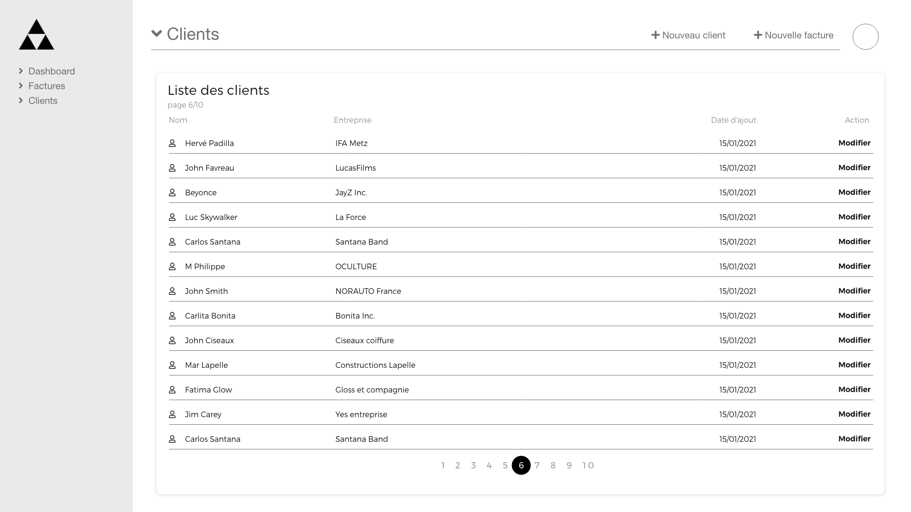
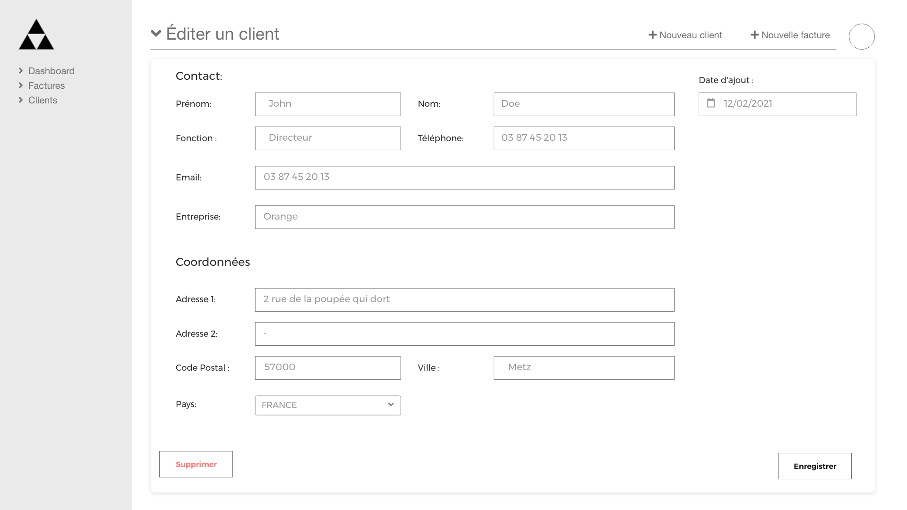
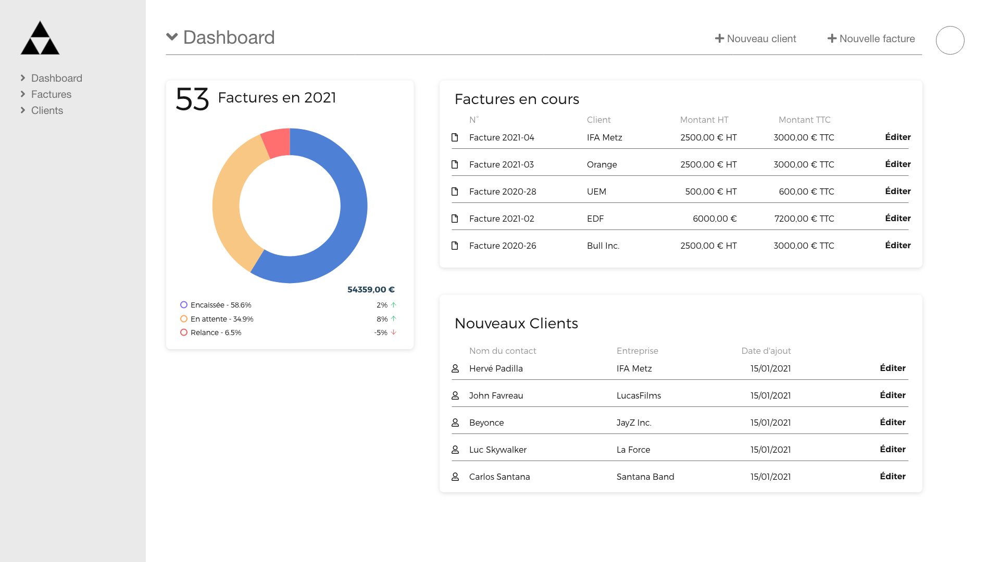

# VueJS / NodeJS

## Objectifs pédagogiques

* créer un frontend complet en VueJS capable de recevoir des données, de les afficher et de les modifier, utilisation du store de vuex, et de vue-router.
* créer un backend basé (au choix) sur une base MongoDB OU lecture/ecriture de fichiers JSON (mook server) capable de lire et d'enregistrer les données et de les envoyer au frontend grâce à une API REST/JSON
* Documenter et tester l'API avec l'application Postman

## Evaluation des connaissances : Questionnaires QCM

Veuillez répondre à ces 2 questionnaires :

* [VueJS (Google form)](https://shorturl.at/guvAM)
* [NodeJS (Google form)](https://shorturl.at/tAGV8)

> Les notes sont attribuées sur 100 pour chaque QCM, vous obtenez votre note en fin de questionnaire, la moyenne des 2 notes est ensuite réalisée pour prise en compte de votre score.

## Evaluation des connaissances : Exercice pratique

> Votre exercice consite à réaliser les vues manquantes de l'application telle que décrites sur les captures d'écrans jointes et la description détaillée qui suit.

En partant du dernier état du dépot du projet achevé ensemble :
https://github.com/washaweb/formation-vuejs-dfs

Vous devrez compléter l'application en ajoutant **la gestion des clients**.

Pour l'intégration vous continuerez à utiliser le framework **Bootstrap-vue** ainsi que les icônes de **font-awesome**. Vous devez respecter l'architecture des données déjà mise en place (utilisation de vuex et du store, utilisation des routes avec vue-router, architecture de l'api avec nodejs...).

### UX des écrans à réaliser

### Objectifs à achever

* **FRONTEND** (Vuejs):
  * Créer la vue de liste des clients (capture d'écran jointe pour le layout)
  * Créer la vue d'édition/modification d'un client
  * Créer un nouveau module du store `client` qui contiendra la logique et l'état pour cette ressource
  * Intégrer le store dans les vues de l'application (intégration du state et des actions dans la vue d'édition et de liste des clients)

* **BACKEND** (Nodejs/MongoDB ou bien édition de fichiers JSON) :
  * Créer un noveau modèle de donnée pour un client
  * Créer des nouvelles routes d'api pour gérer la nouvelle ressource côté backend
  * Intégrer le CRUD pour la ressource `client` :
    1. la route `POST '/clients/'` pour créer un client en BDD (ou fichier JSON)
    2. la route `PUT '/clients/:id'` pour modifier un client en BDD (ou fichier JSON)
    3. la route `GET '/clients/'` pour lister tous les clients de la BDD (ou fichier JSON)
    4. la route `GET '/clients/:id'` pour obtenir les données d'un client en BDD (ou fichier JSON) en fonction de son ID
    5. la route `DELETE 'clients/:id'`  pour supprimer un client en BDD (ou fichier JSON) en fonction de son ID

### Objectif Bonus

En **objectif bonus**, vous pouvez terminer l'intégration de la vue du Dashboard en incluant un composant de graphique, ainsi que la liste des 10 derniers clients selon la capture d'écran ci-dessous.

### Rendu de l'exercice

Pour rendre votre projet, vous devrez me donner accès (au moins en lecture) au dépôt GIT du code de votre exercice finalisé. 

compte GitHub à autoriser si votre projet est en privé : `@washaweb` adresse email: `<webmaster@washaweb.com>`.

En dernier recours, vous pouvez également me faire parvenir une archive zip par email (¡¡¡ sans les `node_modules` !!! )

> Afin de pouvoir reconnaître vos pseudos, n'oubliez pas de **mentionner votre nom complet** (dans le readme du projet, ou sur votre compte GitHub).
