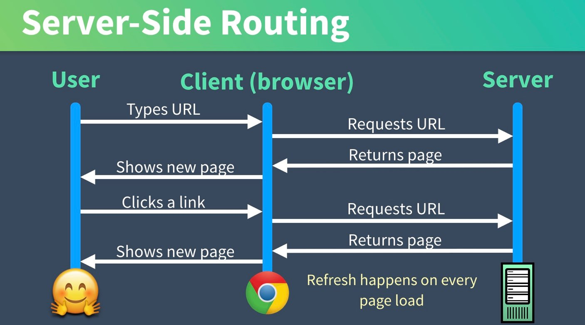
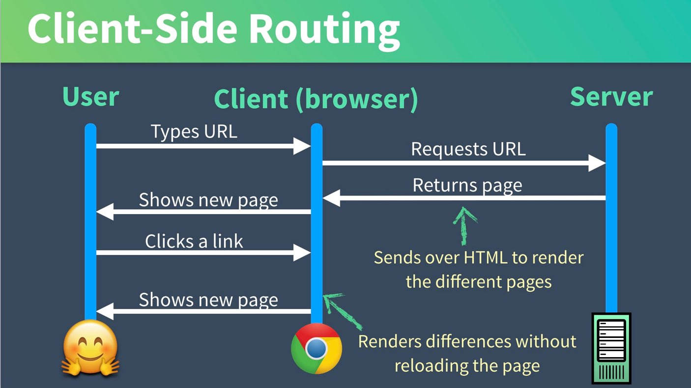

# Vue Router les bases

## Server-Side vs Client-Side Routing

Dans un site web classique, nous connections les pages avec des liens. Les liens font des appels au serveur et le serveur nous renvoie la page suivante. Puis nous recommençons en cliquant sur un nouveau lien, vers une autre page.



Une application de page unique (SPA -> Single Page Application) est définie comme une application Web qui se charge à partir d'une seule page et met à jour dynamiquement cette page lorsque l'utilisateur interagit avec l'application. Cependant, si nous utilisons une application d'une seule page, nous avons besoin d'un moyen de naviguer entre les contenus (routage côté client).

Avec VueJs, et plus généralement dans une SPA, cela qui signifie que le routage se produit dans le navigateur lui-même à l'aide de JavaScript. Notre page Web est chargée à partir d'une seule page `index.html` et nous pouvons utiliser le routage côté client pour présenter dynamiquement différentes vues, selon le lien sur lequel vous cliquez. Souvent, la vue que nous devons afficher a déjà été chargée dans le navigateur, nous n'avons donc pas besoin de contacter le serveur pour cela.



## Vue Router

Vue a sa propre solution de routage officielle, appelée **Vue Router**. Nous avons configuré notre projet avec Vue Router déjà installé à l'aide de Vue CLI.

### package.json

Toutes les dépendances de notre application sont suivies dans notre fichier `package.json`. Si nous jetons un coup d'œil à l'intérieur ici, nous voyons que Vue CLI a déjà inséré Vue Router en tant que dépendance pour notre projet:

```json
      "dependencies": {
        "vue": "^2.5.16",
        "vue-router": "^3.0.1", // <----
        "vuex": "^3.0.1"
      },
```

Cela indique à notre application d'utiliser une version de vue-router compatible avec la version `3.0.1` de Vue-Router.

Lorsque nous avons créé le projet avec la CLI, il a exécuté `$ npm install` et donc installé les dépendances de notre projet.

Voyons ensuite si nous pouvons déterminer où notre bibliothèque de routeurs est chargée. Si vous regardez notre application CLI générée pour nous, nous constatons qu'elle a un fichier `/src/router.js`.

`router.js`

En haut de ce fichier, vous pouvez voir que nous importons la bibliothèque vue-router.

```js
    import Vue from 'vue' // Include Vue
    import Router from 'vue-router' // Include Vue Router libary
    import Home from './views/Home.vue' // <--- We'll look at these in a moment
    import About from './views/About.vue'
```

Ensuite, nous disons à Vue d'utiliser le routeur:

```js
    Vue.use(Router)
```

Et puis nous exportons une instance de routeur avec des routes définies:

```js
    export default new Router({
      routes: [
        {
          path: '/',
          name: 'home',
          component: Home
        },
        {
          path: '/about',
          name: 'about',
          component: About
        }
      ]
    })
```

En haut du fichier, les composants de nos vues sont importés (oui, les "views" sont des composant vue comme les autres !) :

```js
    import Home from './views/Home.vue'
    import About from './views/About.vue'
```

Nous plaçons les composants dans les dossiers `/components` et `/views`. La différence est que lorsque vous utilisez Vue Router, il est préférable de placer les composants ( AKA pages) qui sont chargés par Vue Router dans le répertoire `/views`. Vous conservez ensuite les composants modulaires (réutilisables) dans votre répertoire `/components`.

Nous avons donc défini les 2 vues différentes entre lesquelles notre application va pouvoir naviguer, mais nous n'avons pas encore chargé ce routeur dans notre instance Vue. N'oubliez pas que notre application entière est chargée à partir de notre fichier `main.js`, et si nous regardons à l'intérieur de ce fichier:

`main.js`

Nous pouvons voir que nous importons notre fichier `router.js`, qui apporte ce que nous avons exporté depuis `router.js`.

```js
    import router from './router'
```

Et dans `main.js`, vous remarquerez que nous demandons à notre instance Vue d'utiliser le routeur que nous avons importé:

```js
    new Vue({
      router,
    //...
```

## Créer des liens avec `router-link`

En regardant dans `App.vue`, il y a un `div` avec l'id de "nav" et à l'intérieur il y a des liens de routeur, qui sont des composants globaux auxquels nous avons accès.

```html
    <router-link to="/">Home</router-link>
    <router-link to="/about">About</router-link>
```

Et en dessous :

```html
    <router-view/>
```

Alors qu'est-ce qui se passe ici? `<router-link>` est un composant (de la bibliothèque vue-router) dont le travail consiste à établir un lien avec une route spécifique. Et `<router-view />` est essentiellement un espace réservé où le contenu de notre composant sera rendu sur la page.

Ainsi, lorsqu'un utilisateur clique sur le lien À propos, ils sont dirigés vers `/about`, et comme nous l'avons vu dans `router.js`, cela signifie que le composant `about` se chargera à l'endroit où `<router-view />` est affiché.

### Utiliser des routes nommées

Une autre façon de créer des liens de routeur est d'utiliser des routes nommées. Rappelez-vous comment dans notre `router.js` chacune de nos routes a un nom? Nous pouvons utiliser ces noms. Donc au lieu de:

```html
    <router-link to="/">Home</router-link>
    <router-link to="/about">About</router-link>
```

Nous pouvons aussi écrire:

```html
    <router-link :to="{ name: 'home' }">Home</router-link> |
    <router-link :to="{ name: 'about' }">About</router-link>
```

### Créer des redirections

Dans certains cas (SEO par exemple), il peut être utile de savoir faire des redirections, elle peuvent être simplement ajoutées dans notre fichiers de configuration des routes :

```js
    const router = new VueRouter({
      routes: [
        //...
        {
          path: '/about-us', //page renomée
          name: 'about',
          component: About
        },
        { 
          path: '/about', //redirection
          redirect: { name: "about" }
        }
      ]
    })
```

If we’re using named routes then we don’t need to change our router-links at all. Otherwise we would have to. Then, since there might be links around the internet to our /about page, we want to make that redirect from /about to /about-us, with the following additional route.

### Créer des Alias

Au lieu de rediriger l'ancien chemin, nous pourrions simplement vouloir l'aliaser, ce qui signifie simplement fournir un chemin en double vers le même contenu. Nous pourrions mettre à jour ce chemin et fournir un alias à l'ancien chemin:

```js
    const router = new VueRouter({
      routes: [
        ...
        {
          path: '/about-us',
          name: 'about',
          component: About,
          alias: '/about' // <-----
        }
      ]
    })
```

## Exercice

Créer une nouvelle application vue avec router. Cette application démarre avec trois pages différentes.

`EventList.vue` - Une page d'accueil où nous listons tous les événements. C'est aussi la page racine.
`EventShow.vue` - Une page qui montre les détails d'un seul événement et nous permet de dire que nous assistons à un événement
`EventCreate.vue` - Une page où nous pouvons créer un événement.

Voici le code des composants à créer pour chaque page :

* `EventList.vue`

```vue
    <template>
      <h1>Events Listing</h1>
    </template>
```

* `EventShow.vue`

```vue
    <template>
      <h1>Showing event #1</h1>
    </template>
```

* `EventCreate.vue`

```vue
    <template>
      <h1>Create Event</h1>
    </template>
```

Exercice : Vous devez créer dans `App.vue` le menu de liens qui permettra de naviguer et d'afficher chaque contenu de page.
