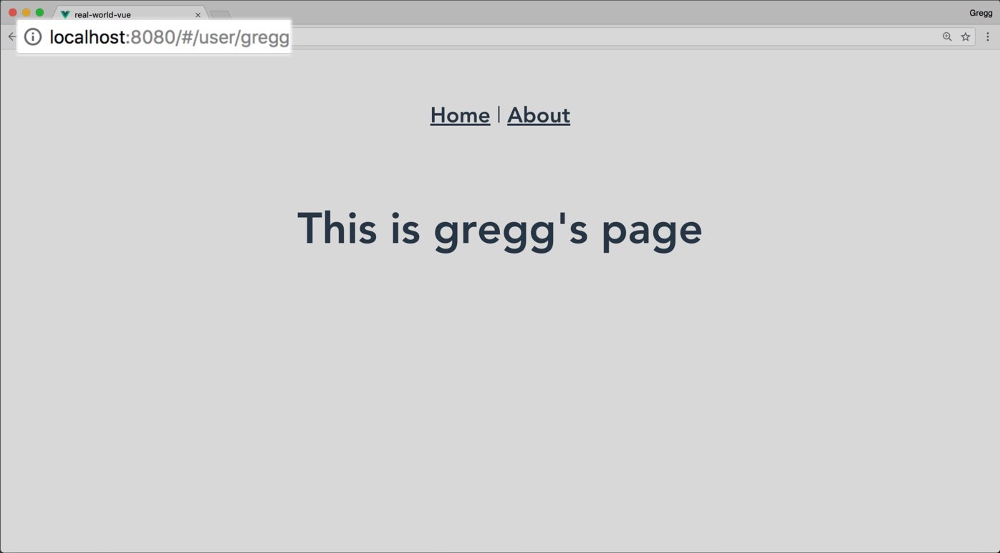

# Routes dynamiques & History Mode

Cette leçon aborde la création d'itinéraires dynamiques et comment utiliser le mode Histoire HTML5 pour se débarrasser du sigle `#` dans l'URL. 

## Créer une route dynamique

Souvent, lorsque la construction de sites Web, nous voulons créer des itinéraires qui contiennent des informations dynamiques, comme par exemple un nom d'utilisateur:  `/users/john` ou john est le nom d'un utilisateur, utilisé en tant que variable de chemin pour afficher les données propres à cet utilisateur en particulier.

Poru faire ça, il faut utiliser un nouveau paramètre dans notre route :

`router.js`

```js
    //...
    import User from './views/User.vue'
    Vue.use(Router)

    export default new Router({
      routes: [
        ...
        {
          path: '/user/:username', //<----- :username est une variable ici
          name: 'user',
          component: User
        }
      ]
    })
```

Pour tirer partie de cette nouvelle route, nous pouvons faire appel à ce nouveau paramètre du routeur dans nos templates :

`/pages/user.vue`

```vue
    <template>
      <div class="user">
        <h1>This is a page for {{ $route.params.username }}</h1>
      </div>
    </template>
```

L'objet `$route` représente l'état de la route active en cours. Il contient des données sur la route, y compris le paramère. Pour en savoir plus sur cet objet consultez la documentation de l'API.

Maintenant si l'on visite la route `/user/gregg`, nous devrions voir ça :



## Utiliser un paramètre dans un lien

Nous pouvons créer un lien vers des itinéraires dynamiques en plaçant les paramètres de nos liens:

```html
    <router-link :to="{ name: 'user', params: { username: 'gregg' }  }">Gregg</router-link>
```

### Utiliser Props pour les routes

Utiliser `$route.params` dans votre composant limite sa flexibilité. Une façon plus modulaire pour créer vos composants dynamiques est de passer le paramètre `props:true` dans la configuration de votre itinéraire.

`router.js`

```js
    //...
    export default new Router({
      routes: [
        {
          path: "/user/:username",
          name: "user",
          component: User,
          props: true
        }
      ]
    });
```

Le `$route.params` sera ainsi envoyé à votre composant comme une `prop` normale.
À l'intérieur de notre composant, il faut adapter le code pour recevoir l'information :

`User.vue`

```vue
    <template>
      <div class="user">
        <h1>{{ username }}</h1>
      </div>
    </template>

    <script>
    export default {
      props: ["username"]
    };
    </script>
```

Tout va fonctionner de la même façon, mais notre composant pourra aussi être réutilisé en tant que composants normal dans un autre contexte, en passant le nom d'utilisateur comme une `prop` du composant.

## Le Hash

Vous avez sans doute remarqué qu'il y a un hachage dans notre URL `http://localhost:8080/#/about-us`, et vous demandez peut-être à quoi sert le « Mode hash » (qui est le mode par défaut pour le routeur Vue).
Le hash d'URL permet de simuler une URL complète, pour que la page ne soit pas rechargé à chaque fois que l'URL change.

Pour l'enlever, nous devons ajouter une configuration à notre `router.js`

```js
    //...
    export default new Router({
      mode: 'history', // <----
      routes: [
       ...
      ]
    })
```

Ceci indique à Vue d'utiliser l'API `history.pushState` du navigateur pour changer l'URL sans recharger la page.

Normalement, lorsque vous chargez `/about-us` sur un serveur, il rechercherait un dossier/fichier about-us.html.
Dans notre application, peu importe ce que l'URL appelle, il faut charger `index.html` qui est notre SPA.
Il faudra donc modifier notre configuration serveur pour faire une redirection des sous pages vers index:

`.htaccess` (serveur apache)

```sh
    <IfModule mod_rewrite.c>
        RewriteEngine On
        RewriteBase /
        RewriteRule ^index\.html$ - [L]
        RewriteCond %{REQUEST_FILENAME} !-f
        RewriteCond %{REQUEST_FILENAME} !-d
        RewriteRule . /index.html [L]
    </IfModule>
```

> Voir la page de documentation de vue à ce sujet : https://router.vuejs.org/guide/essentials/history-mode.html#example-server-configurations

## Faire une page 404

Un effet secondaire de ce mode est que vous pourriez tomber sur une page non valide. Dans ce cas le serveur ne redirige plus vers sa page d'erreur par défaut, c'est à nous de prévoir une nouvelle route à cet effet:

```js
    //...
    const router = new VueRouter({
      mode: 'history',
      routes: [
        ...
        { path: '*', component: NotFoundComponent }
      ]
    })
```

### Exercice

Grâce à ces connaissances, vous allez mettre réaliser une nouvelle application :

`EventList.vue` est un composant qui affiche une liste d'événements
`EventShow.vue` a un segment dynamique `/event`, qui utilise les paramètres en `prop`

`route.js` utilise le mode histoire:

```js
    //...
    export default new Router({
      mode: 'history',
      routes: [
        {
          path: '/',
          name: 'event-list',
          component: EventList
        },
        {  // Note importante: cette route doit être enregistré avant /event/:id
          path: '/event/create',
          name: 'event-create',
          component: EventCreate
        },
        {
          path: '/event/:id',
          name: 'event-show',
          component: EventShow,
          props: true
        }
      ]
    })
```

`EventList.vue`

```vue
    <template>
      <div>
        <h1>Events Listing</h1>
        <p>
          <router-link :to="{ name: 'event-show', params: { id: '1' } }">First Event</router-link>
        </p>
      </div>
    </template>
```

`EventShow.vue`

```vue
    <template>
      <h1>Showing event #{{ id }}</h1>
    </template>
    <script>
    export default {
      props: ['id']
    }
    </script>
```
